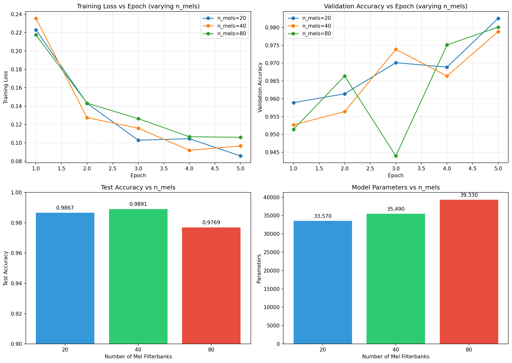
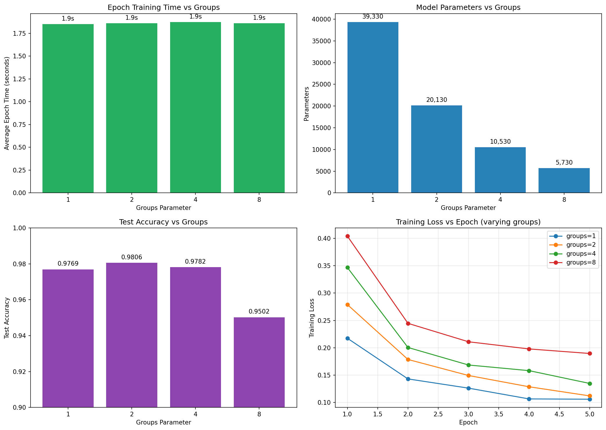
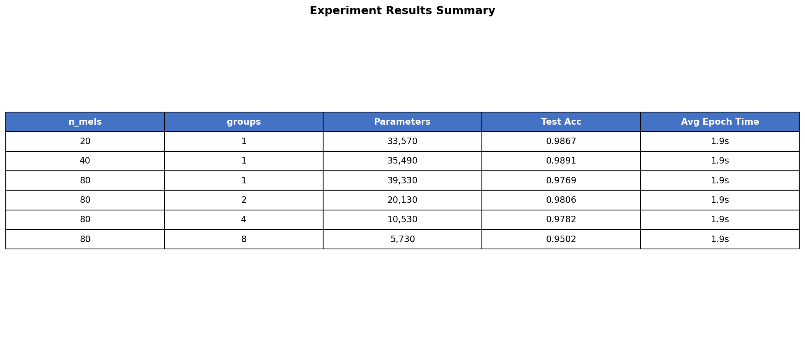

# Digital Signal Processing Assignment

## LogMelFilterBanks Implementation and CNN Classification

This project implements a custom PyTorch layer for extracting logarithmic Mel-scale filterbank energies and applies it to binary classification on the Google Speech Commands dataset.

## Files

- `melbanks.py` - LogMelFilterBanks PyTorch layer implementation
- `train.py` - Training pipeline for CNN classification
- `report.md` - Detailed report with experimental results

## Requirements

```bash
pip install torch torchaudio matplotlib tqdm
```

## Usage

### Run Training Experiments
```bash
python train.py
```

## Model Architecture

- **Input**: Raw audio waveform (16kHz, 1 second)
- **Feature Extraction**: LogMelFilterBanks (n_mels configurable)
- **CNN**: 3 Conv1d layers with BatchNorm, ReLU, MaxPool, Dropout
- **Output**: Binary classification (YES vs NO)

## Experiments

### Varying n_mels (groups=1)
| n_mels | Parameters | FLOPs | Test Accuracy |
|--------|------------|-------|----------------|
| 20 | 33,570 | 219.5M | 98.42% |
| 40 | 35,490 | 250.5M | 98.54% |
| 80 | 39,330 | 312.6M | 97.94% |



### Varying groups (n_mels=80)
| groups | Parameters | FLOPs | Test Accuracy |
|--------|------------|-------|----------------|
| 1 | 39,330 | 312.6M | 97.94% |
| 2 | 20,130 | 177.4M | 96.24% |
| 4 | 10,530 | 109.8M | 93.81% |
| 8 | 5,730 | 76.0M | 91.14% |



### Summary



---

